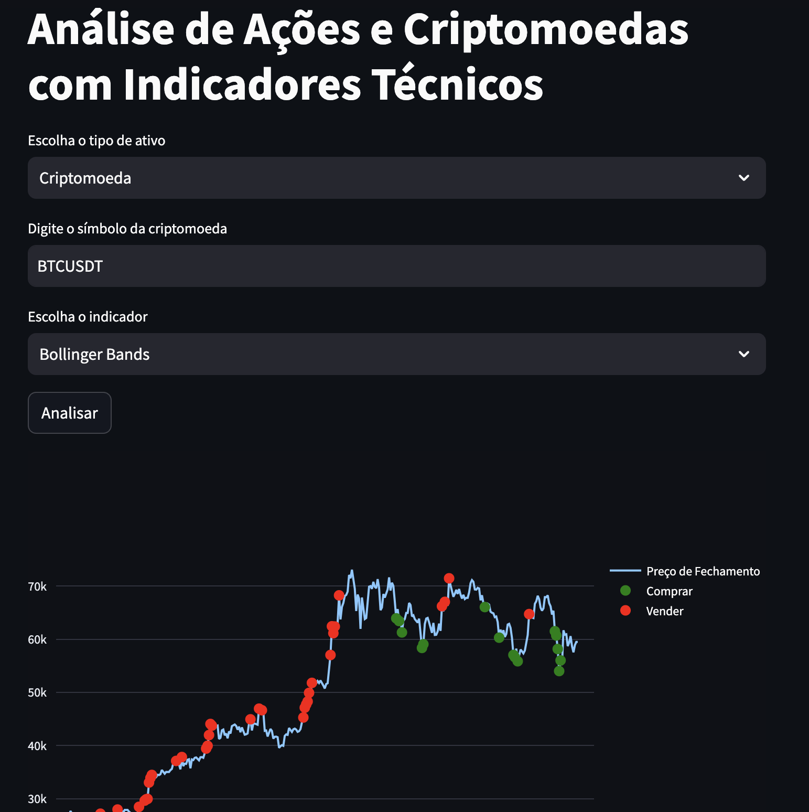
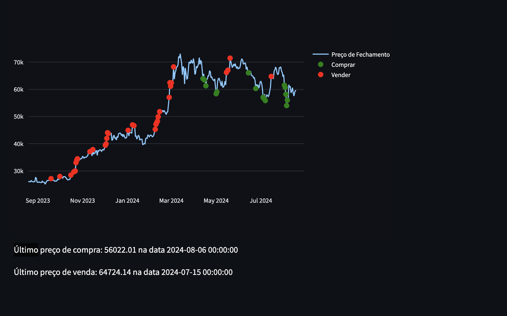

## Análise de Ações e Criptomoedas com Indicadores Técnicos





Este projeto usa **Streamlit** para criar uma aplicação interativa que analisa dados de ações e criptomoedas com indicadores técnicos, utilizando **yfinance**, **pandas_ta**, e a API da **Binance**. O objetivo é fornecer recomendações de compra e venda baseadas em indicadores como MACD, RSI e Bandas de Bollinger.

## Requisitos

- **Python 3.11** ou superior
- **Docker** e **Docker Compose**

## Tecnologias Utilizadas

- **Streamlit**: Para a interface interativa.
- **yfinance**: Para baixar dados históricos de ações.
- **pandas_ta**: Para calcular indicadores técnicos.
- **python-binance**: Para obter dados históricos de criptomoedas.
- **plotly**: Para visualização dos dados.

## Configuração

### 1. Clonando o Repositório

Clone este repositório para sua máquina local:

```
git clone https://github.com/seu-usuario/seu-repositorio.git
cd seu-repositorio
```

### 2. Arquivo .env

Crie um arquivo chamado .env na raiz do projeto com o seguinte conteúdo. Substitua os valores das chaves da API pelas suas próprias credenciais da Binance:

```
BINANCE_API_KEY=suas_chaves_binance_api_key
BINANCE_API_SECRET=sua_chave_binance_api_secret
```

##3. Construir e Rodar a Aplicação

Com o Docker e Docker Compose instalados, você pode construir e rodar a aplicação com os seguintes comandos:

```
docker-compose build
docker-compose up
```

 aplicação será acessível em http://localhost:8501.

Como Usar

	1 Escolha o Tipo de Ativo: Selecione entre “Ação” ou “Criptomoeda”.
	2.Digite o Ticker/Símbolo: Para ações, insira o ticker (por exemplo, AAPL). Para criptomoedas, insira o símbolo (por exemplo, BTCUSDT).
	3.Escolha o Indicador: Selecione o indicador técnico que deseja usar (MACD, RSI ou Bollinger Bands).
	4.Clique em “Analisar”: A aplicação exibirá gráficos e recomendações de compra e venda com base no indicador selecionado.

Notas

	•Certifique-se de que suas credenciais da Binance estão corretamente configuradas no arquivo .env.
	•Para ajustar o código, faça modificações no arquivo app.py e reconstrua o contêiner Docker se necessário.

Licença

Este projeto está licenciado sob a MIT License.

Contato

Para perguntas ou sugestões, entre em contato com thdamiaos@gmail.com
